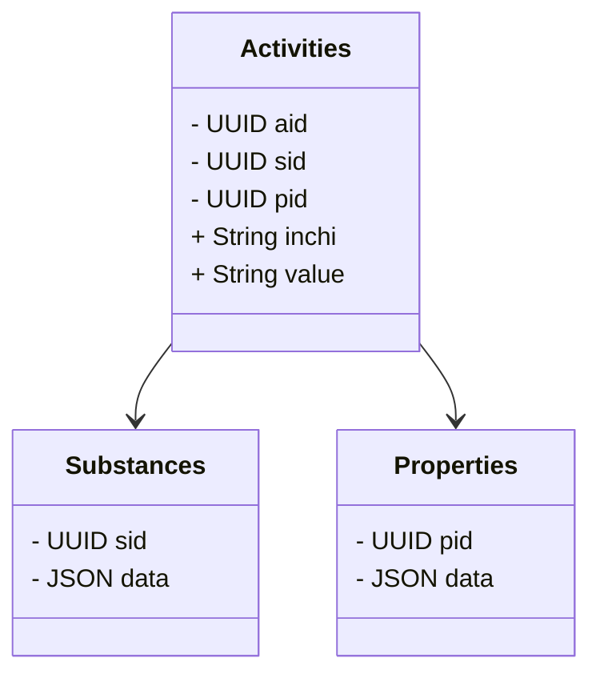

# chemharmony
Chemharmony harmonizes some simple chemical properties.

It reduces databases into three tables:

## FAQ
### This schema seems limited. What about capturing metabolism data? Or dose response data? 
This schema is focused on building QSAR models, but a more flexible graph based schema might be better. Ultimately, capturing data that relates compounds with each other or with other entities through reactions, metabolism, etc. could be captured by adding more tables. Graph schemas can be isomorphic with that approach.

2. 