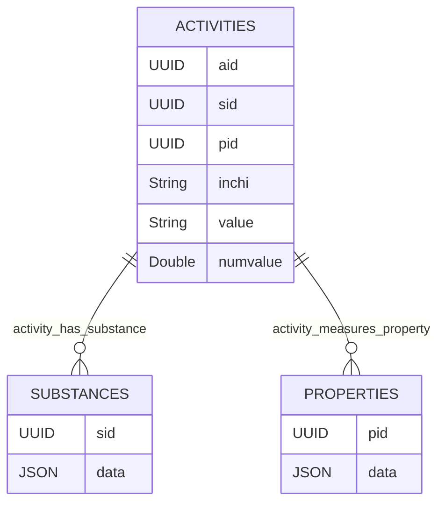

# chemharmony - a large scale chemical activity store
Chemharmony harmonizes some simple chemical properties.

It reduces databases into three tables:

The primary tables in this project are substances, properties and activites. 

Each activity assigns a 0 or a 1 to a given substance and property:

`activity` ~ `substance` + `property` 

# Other
There are a few other more experimental tables right now.

Property_categories are the result of a GPT4 classification of the Properties `data` field, each classification assigns a property to one or more `category` with an associated `reason` and `strength`. A strength of 1 is the weakest and 10 the strongest. 

## FAQ
### This schema seems limited. What about capturing metabolism data? Or dose response data? 
This schema is focused on building QSAR models, but a more flexible graph based schema might be better. Ultimately, capturing data that relates compounds with each other or with other entities through reactions, metabolism, etc. could be captured by adding more tables. Graph schemas can be isomorphic with that approach.
