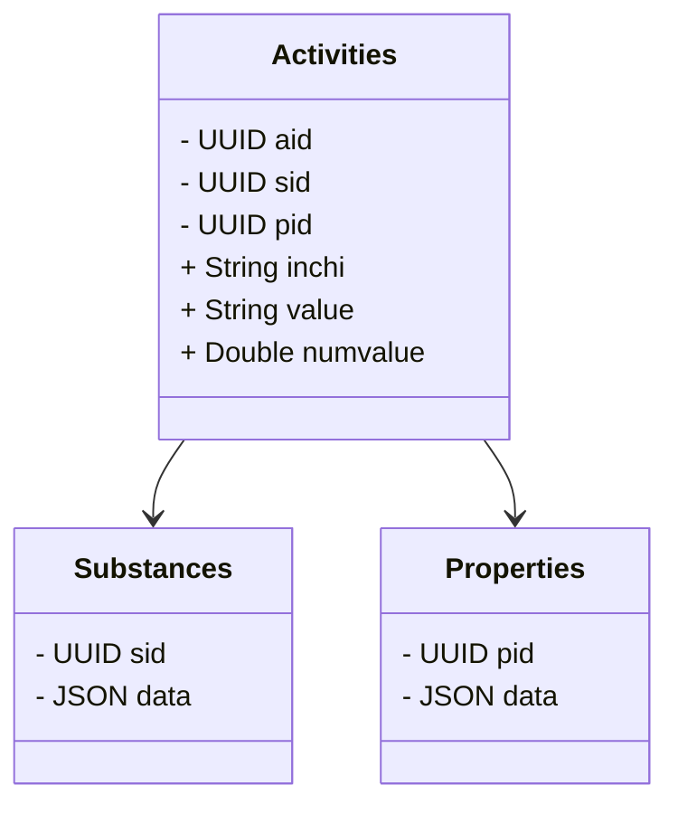

# chemharmony - a large scale chemical activity store
Chemharmony harmonizes some simple chemical properties.

It reduces databases into three tables:



## FAQ
### This schema seems limited. What about capturing metabolism data? Or dose response data? 
This schema is focused on building QSAR models, but a more flexible graph based schema might be better. Ultimately, capturing data that relates compounds with each other or with other entities through reactions, metabolism, etc. could be captured by adding more tables. Graph schemas can be isomorphic with that approach.

# TODO
- [x] src/01_integrate_toxvaldb.R
- [x] src/04_integrate_toxcast.R
- [x] src/05_integrate_reach.R
- [x] src/03_integrate_tox21.R 
- [x] src/10_bindingdb.R 
- [x] src/11_integrate_toxrefdb.R
- [x] src/08_integrate_pubchem.py
- [x] src/07_integrate_ctdbase.R 
- [x] src/02_integrate_chembl.R
- [x] src/06_integrate_ice.R

- [ ] identify reprotox
- [ ] identify exxon
- [ ] src/99_harmonization.R

- [ ] modeling thursday, friday
- [ ] exxon report

- [ ] src/09_integrate_qsartoolbox.R # simplified but still needs work
```
Hi,

I reviewed last week an EPA risk assessment for p-Cymene 99 99-87-6.

 

Could you run this through your predictive tools?

 

I would like to know especially inhalation tox and similar substances for read-across.

Want to use it for my presentations.

 

I used some LLM to retrieve data with quite interesting results.

Best

T.
```