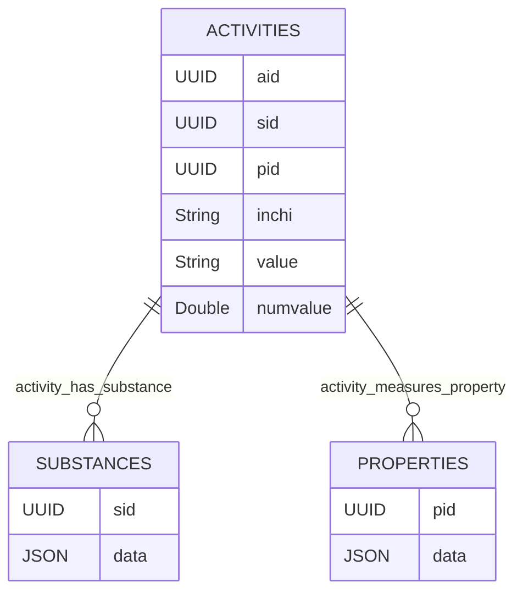

# chemharmony - a large scale chemical activity store
Chemharmony merges many chemical databases in a single set of a 3 tables:

The primary tables in this project are substances, properties and activites. 

Currently, each activity assigns a 0 or a 1 to a given substance and property:

`activity` ~ `substance` + `property` 

The 0 or 1 is chosen to indicate whether a given chemical is 'positive' or 'negative' for a given property. The meaning of positive or negative can vary by property. In case of chemical classifications like acute oral toxicity, positive (or 1) means that the chemical is an acute oral hazard and negative (or 0) means that it is not. For numeric properties like LD50 or binding affinity we often choose for positive to mean a chemical hs a value below the median and negative to mean it is above the median. Future versions of this repository will store the raw value of the activity. 

# Other
There are a few other more experimental tables right now.

Property_categories are the result of a GPT4 classification of the Properties `data` field, each classification assigns a property to one or more `category` with an associated `reason` and `strength`. A strength of 1 is the weakest and 10 the strongest. 

## FAQ
### This schema seems limited. What about capturing metabolism data? Or dose response data? 
This schema is focused on building QSAR models, but a more flexible graph based schema might be better. Ultimately, capturing data that relates compounds with each other or with other entities through reactions, metabolism, etc. could be captured by adding more tables. Graph schemas can be isomorphic with that approach.